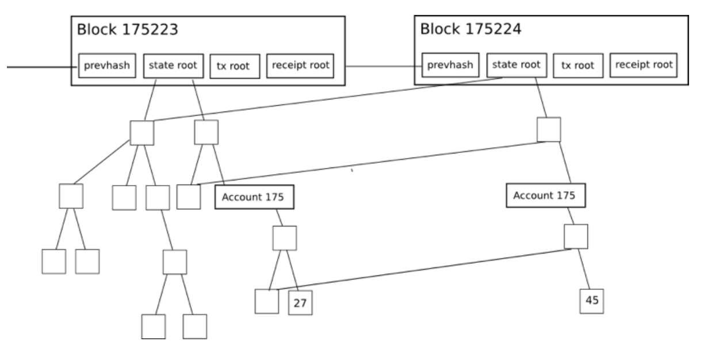
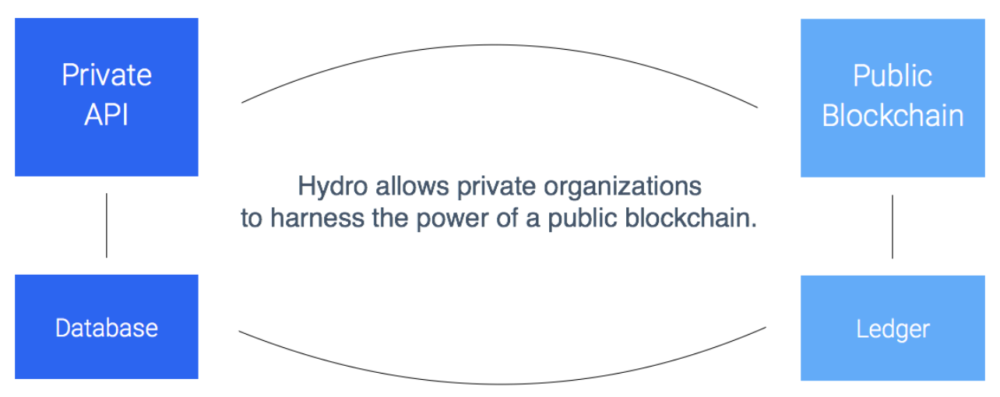
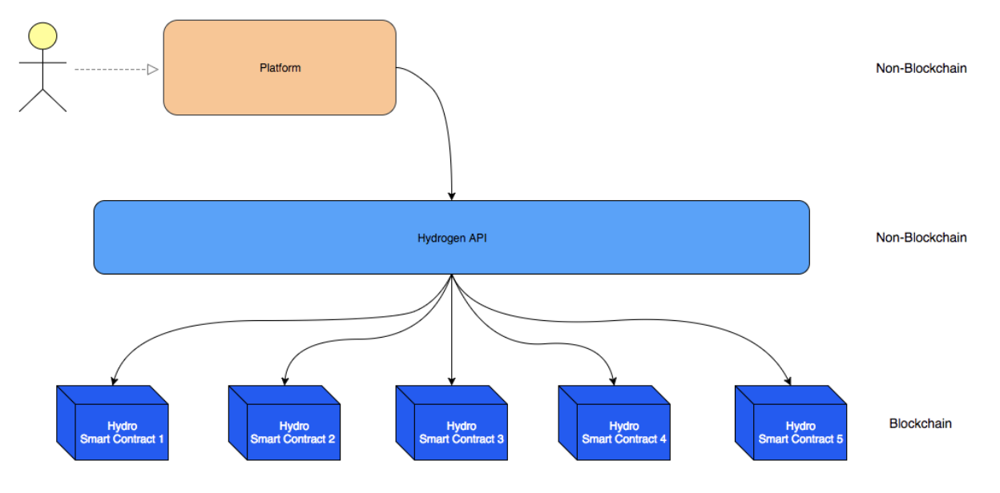
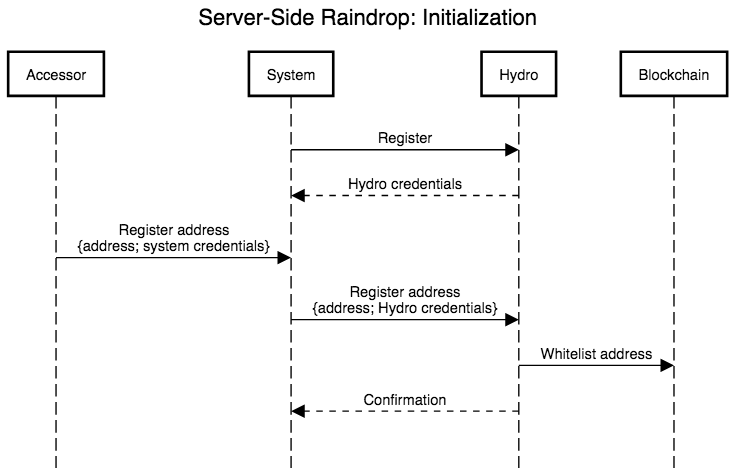
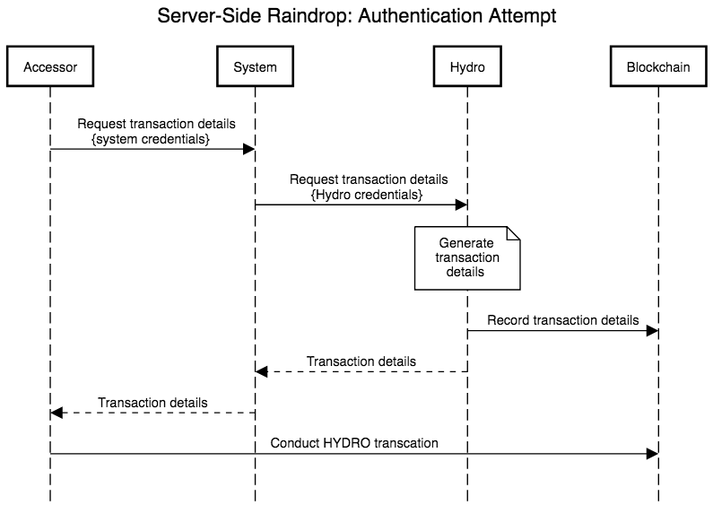
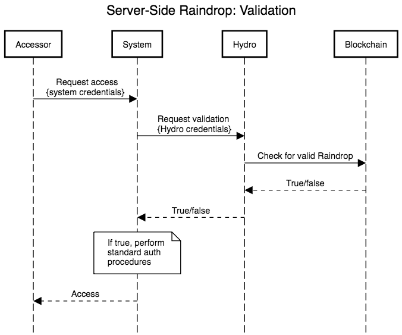
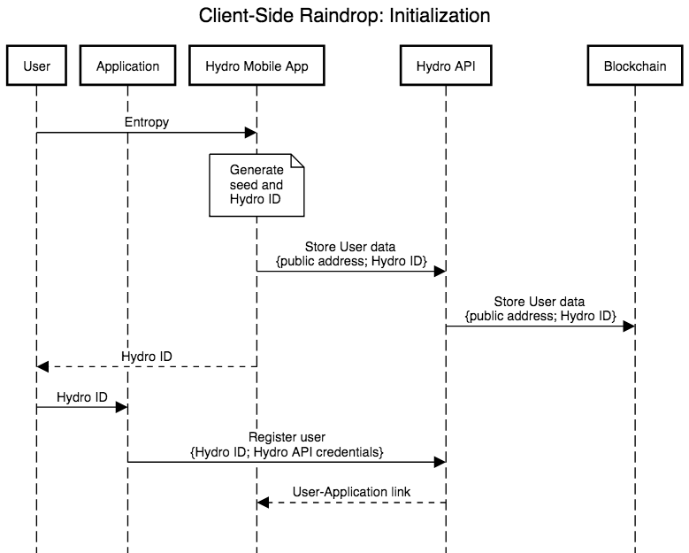
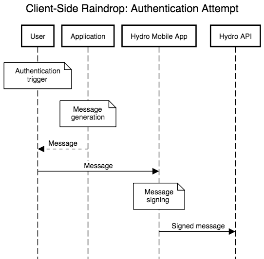
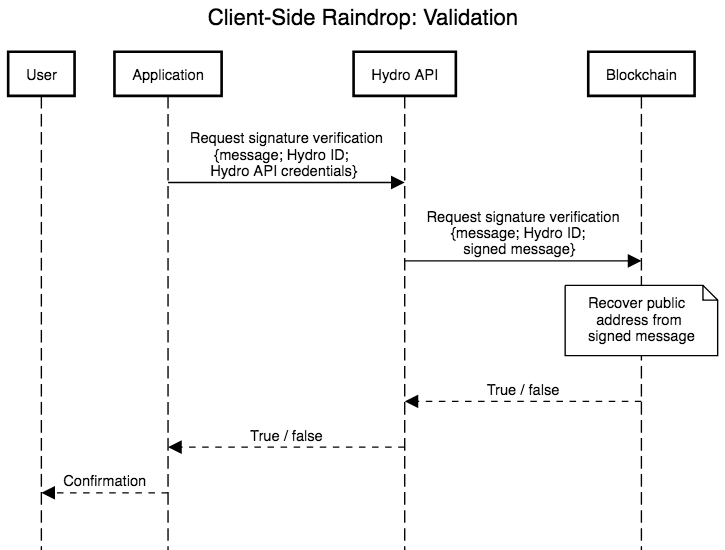

# HYDRO Raindrop: Public Authentication On The Blockchain
### May 2018

_______________________________________________________________

## Table of Contents
- [Abstract](#abstract)
- [Blockchain & Ethereum](#blockchain--ethereum)
  - [Public-Key Cryptography](#public-key-cryptography)
  - [Merkle Trees](#merkle-trees)
  - [Building on Ethereum](#building-on-ethereum)
  - [Smart Contracts](#smart-contracts)
  - [Ethereum Virtual Machine & Gas](#ethereum-virtual-machine--gas)
- [Hydro Design](#hydro-design)
  - [Private vs. Permissioned vs. Public Networks](#private-vs-permissioned-vs-public-networks)
  - [A Public Ledger for Private Systems](#a-public-ledger-for-private-systems)
  - [Architecting for Adoption](#architecting-for-adoption)
- [Raindrop](#raindrop)
  - [The State of Financial Security](#the-state-of-financial-security)
  - [Equifax Breach](#equifax-breach)
  - [Adding a Blockchain Layer](#adding-a-blockchain-layer)
  - [Server-Side Raindrop](#server-side-raindrop)
    - [Overview](#overview)
    - [Benefits from the Blockchain](#benefits-from-the-blockchain)
    - [A Detailed Look](#a-detailed-look)
    - [Case Study: Server-Side Raindrop & Hydrogen](#case-study-server-side-raindrop--hydrogen)
  - [Client-Side Raindrop](#client-side-raindrop)
    - [Overview](#overview)
    - [Benefits from the Blockchain](#benefits-from-the-blockchain)
    - [A Detailed Look](#a-detailed-look)
  - [Opening Raindrop To The Public](#opening-raindrop-to-the-public)
- [Risks](#risks)
- [Conclusion](#conclusion)

_______________________________________________________________

## Abstract

HYDRO: Etymology - From Ancient Greek ὑδρο- (hudro-), from ὕδωρ (húdōr, “water”)

The Hydrogen platform allows enterprises and developers globally to prototype, build, test, and deploy sophisticated financial technology applications and products. Hydro is a new component that brings blockchain-based capabilities to the Hydrogen ecosystem and beyond.

Hydro enables new and existing private systems to seamlessly integrate and leverage the dynamics of a public blockchain for functional use cases surrounding application security, identity management, document management, transaction processing, and artificial intelligence. The Hydro technology stack broadly allows for the establishment of hybrid systems, which are fundamentally private but augmented with the advantages of a public ledger to achieve greater decentralization, transparency, and immutability.

This paper introduces Hydro and explores the initial use case - an authentication layer involving a public blockchain that can act as a supplement to existing off-chain authentication protocols. The proposed framework is called Raindrop and it seeks to provide additional security for sensitive data that is increasingly at risk of compromise.

The Raindrop framework consists of two main components: Server-Side Raindrop and Client-Side Raindrop. The former adds an authentication layer to large-scale systems including data lakes, enterprise softwares, APIs, administrative portals, and more, while the latter adds a layer of security to consumer-facing facets of an application or platform.

## Blockchain & Ethereum

Hydro is implemented on Ethereum, an open-source public blockchain platform launched in 2015. Before providing more detail on the project, it is important to review some fundamental ideas about blockchain and Ethereum.

### Public-Key Cryptography
Public key cryptography is an asymmetric framework that relies on key pairs. These pairs consist of public keys (that are not secret) and private keys (that are held secretly by the owners of the corresponding public keys). A public key can be derived from it's corresponding private key, but not the other way around.

Various techniques are used to create useful interactions between public and private keys. One use of public-key cryptography for blockchains such as Bitcoin and Ethereum revolves around a concept known as digital signatures. With digital signatures, a message can be signed with a private key and another party can validate the public key of the message author. This concept can be used within a blockchain network to help ensure that hackers do not impersonate people or forge signatures.

Ethereum utilizes Elliptic Curve Digital Signature Algorithm (ECDSA) to validate transaction signatures.

ECDSA leverages the infeasibility of solving certain mathematical calculations based on the structure an elliptic curve, such as the one depicted above. In its signature model, Ethereum uses a particular kind of elliptic curve that conforms to the secp256k1 parameter set.

### Merkle Trees
Merkle trees are used in distributed systems for efficient data verification. They are efficient because they use hashes instead of full files. Hashes are ways of encoding files that are much smaller than the actual file itself.
Every block header in Ethereum contains three Merkle Trees for Transactions, Receipts, and States:

Source: [Merkling in Ethereum](https://blog.ethereum.org/2015/11/15/merkling-in-ethereum/); Vitalik Buterin, Ethereum Founder

This makes it easy for a light client to get verifiable answers to queries such as:

- Does this account exist?
- What is the current balance?
- Has this transaction been included in a particular block?
- Has a particular event happened in this address today?

### Building on Ethereum
Much as apps like Snapchat were built with Swift and other tools offered on top of the Apple iOS platform, so too can blockchain applications be built on top of Ethereum. Snap Inc. didn’t need to build iOS, it used it as infrastructure to launch a game-changing social media application.

Project Hydro is similar. It relies on the thousands of developers globally that are working to make underlying blockchain technology faster, stronger, and more efficient. Hydro leverages this constantly improving infrastructure by developing product-focused interactions around blockchain technology that can offer tangible benefits to financial services applications.

### Smart Contracts
A key concept enabled by Ethereum and other blockchain-based networks is that of smart contracts. These are self-executing blocks of code that multiple parties can interact with, cutting out the need for trusted middlemen. Code in a smart contract can be seen as similar to the legal clauses in a traditional paper contract, but can also achieve much more expansive functionality. Contracts can have rules, conditions, penalties for non-compliance, and can kickstart processes and other contracts. When triggered, contracts execute as originally stated at the time of deployment on the public chain, offering built-in elements of immutability and decentralization.

The smart contract is a vital tool for building on the Ethereum infrastructure. Core functionality of the Hydro blockchain layer is achieved via custom contracts, as discussed later in this paper.

### Ethereum Virtual Machine & Gas
The Ethereum Virtual Machine (EVM) is the runtime environment for smart contracts on Ethereum. The EVM helps to prevent Denial of Service (DoS) attacks, ensures programs remain stateless, and enables communication that cannot be interrupted. Actions on the EVM have costs associated with them, denominated in gas, which depend on the computational resources required for execution. Every transaction has a maximum amount of gas allotted to it, known as a gas limit. If the gas consumed by a transaction reaches the limit, it will cease to continue processing.

## Hydro Design
The Hydro technology ecosystem follows a design philosophy centered around achieving use cases that marry private systems with the advantages of blockchain, including decentralization, immutability, and transparency. Consequently, the underlying blockchain architecture is of critical importance.

### Private vs. Permissioned vs. Public Networks
There are several ways that blockchain network architecture can be implemented. The various approaches can generally be categorized as Private, Permissioned, or Public. The primary difference between these network architectures is in the nature of the nodes involved in securing and/or verifying the ledger and its entries. The variance in implementation has implications for the aforementioned advantages of blockchain, as depicted in the table below:

Category | Description | Decentralization | Immutability | Transparency
-------- | ----------- | ---------------- | ------------ | ------------
Private | Nodes in the network are majorly or entirely run by a private party | None | None | Not Guaranteed
Permissioned | Nodes in the network are run by 3rd parties who are granted express permission by a private party | Low | Moderate | Not Guaranteed
Public | Nodes in the network may be run by any party with sufficient technical capability | High | High | Guaranteed

As a caveat, there are many nuances that can impact the dimensions shown above; the strength of a given blockchain depends on the specific implementation. Despite that, public ledgers (such as Ethereum) offer the best ability to cultivate the advantages that are vital to Hydro's mission.

### A Public Ledger for Private Systems
The systems that power financial services platforms, websites, and applications can often be described as mediums of data flow - they send, retrieve, store, update, and process data for the entities they interface with. Because of the nature of this data, and of financial services more generally, these systems often house complex operations in a private and centralized manner. Reliance on private structures, in turn, opens the door for a variety of security, integrity, and efficiency gains to be had by incorporating external forces that exceed the scope of the internal system.

Such is the case with the Hydrogen platform. Hydro aims to add value by allowing Hydrogen users to interface with a blockchain in ways that are seamlessly integrated into the fundamentally private Hydrogen ecosystem.

Public blockchain-based operations can occur before, during, or after private operations. The interplay between private and public elements can serve to validate, stamp, record, or enhance processes within an ecosystem.

The ethos of this model is making processes more robust by tapping into the benefits of blockchain technology specifically where it can produce the most positive impact. While this hybrid framework may not be applicable to all platforms, Hydro focuses on creating technology for the cases in which it is.

### Architecting for Adoption
Hydro differs from many existing blockchain initiatives, because it can exist independently and layer around new or existing systems without requiring systemic change. Rather than replace, Hydro aims to augment. Developers and enterprises can access blockchain capabilities easily by hooking into standard APIs via the Hydrogen platform.

The scope of financial services platforms that can leverage Hydrogen is broad. These platforms can power virtually any experience, house any number of proprietary services, perform any private data operation, and deploy in any environment. This is enabled by Hydrogen's structural modularity and is synergistic with Hydro, acting as a complementary driver of adoption.

##Raindrop
Built on top of the Hydro public ledger is a blockchain-based authentication service, called Raindrop. This offers a layer of security that helps verify if an access request is coming from an appropriate source.

Hydro Raindrop offers a way to enhance off-chain authentication protocols by incorporating blockchain mechanics as a component of a single- or multi-factor authentication process. This can add a useful layer of security to help thwart system breaches and data compromises.

Before examining technical aspects of Raindrop, let’s first take a look at the problem it is trying to solve.

### The State of Financial Security
The rise of the data age has brought with it a rise in vulnerability, and this is particularly important for financial services. Financial platforms are often gateways to large quantities of private and sensitive data such as government ID numbers, account credentials, and transaction histories. Because of how critically important this data is, unwarranted access is typically met with catastrophic results.

Industry research firm Trend Micro published a report that found stolen line items of Personally Identifiable Information (PII) is sold on the Deep Web for as little as $1, scans of documents like passports are available for as little as $10, and bank login credentials for as little $200, making the distribution of stolen data increasingly fragmented and untraceable.

Unfortunately, the existing financial system does not have a spotless track record when it comes to preventing, diagnosing, and communicating data breaches with its stakeholders.

- According to a recent study by Javelin Strategy & Research - The 2017 Identity Fraud Study - $16 billion was stolen from 15.4 million U.S. consumers in 2016 due to failures of the financial system to protect Personally Identifiable Information (PII).

- In April 2017, Symantec published its Internet Security Threat Report, which estimates 1.1 billion pieces of PII were compromised in various capacities over the course of 2016.

- The 2016 Year End Data Breach Quickview by Risk Based Security, found that 4,149 data breaches occurred in businesses globally in 2016, exposing over 4.2 billion records.

- The 2017 Thales Data Threat Report – Financial Services Edition, a survey of global IT professionals in professional services, found that 49% of financial services organizations have suffered a security breach in the past, 78% are spending more to protect themselves, but 73% are launching new initiatives related to AI, IoT, and cloud technologies before preparing appropriate security solutions.

### Equifax Breach
On July 29th 2017, Equifax - a 118 year old U.S. credit reporting agency - was hacked. 143 million consumers had PII exposed, including Social Security Numbers. 209,000 customers had credit card data compromised.

What was the cause of this breach?

It starts with one of the backend technologies utilized by Equifax. Struts is an open source framework for developing web applications in the Java programming language, built by the Apache Software Foundation. CVE-2017-9805 is a vulnerability in Apache Struts related to using the Struts REST plugin with the XStream handler to handle XML payloads. If exploited, it allows a remote unauthenticated attacker to run malicious code on the application server to either take over the machine or launch further attacks from it. This was patched by Apache two months before the Equifax breach.

Apache Struts contains a flaw in the REST Plugin XStream that is triggered as the program insecurely de-serializes user-supplied input in XML requests. More specifically, the problem occurs in XStreamHandler’s toObject() method, which does not impose any restrictions on the incoming value when using XStream deserialization into an object, resulting in arbitrary code execution vulnerabilities.

Even if this REST plugin was compromised, should it have mattered? Is there a way to use blockchain technology to secure the financial information of these 143 million customers while still relying on incumbent REST API and Java-based systems?

### Adding a Blockchain Layer
It is clear that the integrity of data gateways can be improved.

The fundamental consensus mechanisms of the Ethereum network allow participants to systematically agree on ledger entries. This applies to both transfers of value and smart contract state changes, and provides novel vectors for mitigating unauthorized access to pathways that handle sensitive data. The distributed, public, and decentralized nature of the Ethereum ledger adds a new layer that can make authentication more robust.

With Raindrop, authentication can leverage the power of blockchain technology and be enforced as a precondition that interacts seamlessly with standard off-chain processes. The specific details of how this works differs between the two Raindrop protocols: Server-Side and Client-Side.

### Server-Side Raindrop

#### Overview
Rain contains packets of condensed water ranging from 0.0001 to 0.005 centimeters in diameter. In a typical rainstorm, there are billions of these packets, each of random size, velocity, and shape. Because of that, one cannot reliably predict the exact nature of rain.

Server-Side Raindrop is predicated on harnessing that unpredictability. The main driver of the protocol is the validation of very specific transactions that occur on the blockchain - akin to describing a single packet of water during a rainstorm. Every Server-Side Raindrop authentication transaction is unique and virtually impossible to have occurred by chance.

Financial services platforms commonly utilize micro-deposit verification to validate client accounts. The concept is simple: the platform makes small deposits of random amounts into a user's claimed bank account. In order to prove the user indeed owns said account, he or she must relay the deposit amounts back to the platform, which are then validated. The only way the user can know the valid amounts (besides guessing) is by having direct access to the bank account in question.

Server-Side verification with Raindrop is analogous. Rather than sending the user an amount and having it relayed back, Hydro defines a transaction and the user must execute it from a known wallet. The only way the user can conduct a valid transaction is by having direct access to the wallet in question.

#### Benefits from the Blockchain
Because the ledger is on a decentralized and distributed network, transaction processing is not subject to single points of failure. This on-chain activity provides a reasonable failsafe that the transactional aspect of Server-Side Raindrop can remain functional without dependence on any trusted party.

The public nature of the ledger also ensures that any party (be it a private system or a verified user) can monitor authentication attempts - from anywhere in the world, in real time. Such a level of transparency is a substantial advantage, particularly when it pertains to authenticating systems that house sensitive and expensive data.

#### A Detailed Look
There are four entities involved in the Server-Side Raindrop authentication process:

1. Accessor - The party attempting to gain access to a System.
2. System - The system or gateway that is being accessed by the Accessor.
3. Hydro API - The module that is utilized by the System to process information as well as communicate and interface with the blockchain.
4. Blockchain - The distributed public ledger that processes HYDRO transactions and executes Hydro smart contracts, through which information may be pushed, pulled, or otherwise operated upon.

Each Server-Side Raindrop transaction, in its entirety, is a set of five parameters:

1. Sender - The address that must initiate the transaction.
2. Receiver - The transaction's destination. This corresponds to a method in a Hydro smart contract on the blockchain.
3. ID - An identifier that is associated with the System.
4. Quantity - A precise number of HYDRO to send.
5. Challenge - A randomly generated alphanumeric string.

Below is an outline of the Server-Side Raindrop authentication process, which can be generally classified into three stages:

1. Initialization
2. Authentication Attempt
3. Validation

Initialization begins with a System (e.g. Hydrogen) registering to use Hydro and obtaining credentials, enabling the system to communicate with the blockchain via the Hydro module. The System onboards an Accessor (e.g. a financial institution) who registers a public address, and then passes the registered address to Hydro. This address is immutably written onto the blockchain to a whitelist stored in a Hydro smart contract. The System receives a confirmation that the address was whitelisted, which can also be verified as a publicly viewable event. System registration need only occur once, while Accessor whitelisting need only occur once per Accessor.

After Initialization is complete, the core of the Hydro authentication process can begin. The Accessor, who must execute a transaction, jumpstarts this process by requesting the transactional details from the System, and the System routes the request to the Hydro API. The Hydro API generates a new set of transactional parameters, stores certain details immutably on the blockchain, and returns the full details to the Accessor via the System. The Accessor, equipped with all required information, conducts a transaction from the registered address to a method in the Hydro smart contract. If the sender's address is not whitelisted, the action is rejected - otherwise, it is recorded in the smart contract. It is important to note that this transaction should occur outside of the System, directly from the Accessor to the Blockchain, as it requires the Accessor's private key (which only the Accessor should be able to obtain).

The final step of the process is Validation. In this step, the Accessor officially requests access to the System via the System's established mechanism. Prior to implementing any of its standard authentication protocols, the System asks Hydro whether or not the Accessor has performed a valid transaction. Hydro interfaces with the smart contract, checks for validity, and responds with a true/false designation. The System is able to decide how it should proceed based on this designation - if it is false, the System can deny access, and if it is true, the System can grant access.

If we consider the base System credentials - or whatever existing System protocols that are in place - to broadly be one layer of authentication, it is critical that the Hydro authentication layer provides a useful second layer. By examining the two primary attack vectors, we can readily confirm its usefulness:

- Vector 1 - Attacker steals the Accessor's base System credentials
  - Attacker attempts to gain access to the System with valid System credentials
  - System checks with the Hydro API to determine if a valid transaction was made on the blockchain
  - The Hydro API returns false, and the System denies access
- Vector 2 - Attacker steals the private key(s) to the Accessor's wallet
  - Attacker attempts to conduct a transaction from the registered address, without other required transactional details
  - Attacker cannot make a valid blockchain transaction
  - Attacker also cannot request access to the System without the proper System credentials

It is clear that the Attacker must steal both the base System credentials and the Accessor's private wallet key(s) in order to access the System. In this regard, Hydro has successfully added an additional layer of authentication.

#### Case Study: Server-Side Raindrop & Hydrogen
There are dozens of ways Server-Side Raindrop can be used by private organizations. APIs, databases, and networks have created elaborate systems of tokens, keys, apps, and protocols over the last decade, in an attempt to secure sensitive data. Server-Side Raindrop can be used alongside all of these more traditional off-chain mechanisms.

As an example, here is a overview of how Server-Side Raindrop authentication fits into the Hydrogen API platform:

1. Hydrogen API partners must first have the IP addresses of their various environments whitelisted.
2. Partners must request to whitelist a public Hydro address.
3. All calls to the Hydrogen APIs and transfers of data are encrypted and transmitted through the HTTPS protocol.
4. Developers must complete a valid Raindrop transaction from the registered Hydro address.
5. Developers then perform OAuth 2.0 validation. OAuth (Open Authorization) is an open standard for token-based authentication and authorization. Hydrogen supports the “Resource Owner Password Credentials” and “Client Credentials” grant types, and each API user must provide credentials for an authentication request.
6. The Hydrogen developer is granted a unique OAuth 2.0 token, to be passed in the header for subsequent API calls.
7. The token is valid for 24 hours, after which the developer must validate again and get a new token.

If any of these steps is violated, the user is immediately locked from API access. A hacker cannot bypass all of these security factors by guessing randomly, because there are trillions of unique combinations.

Hydro blockchain-based authentication is an important component of the Hydrogen security protocol. The Hydrogen team encourages partners to set up multi-signature wallets, and store private keys in multiple secure locations independently from other credentials, so there is not a single point of failure. A properly secured multi-signature wallet is not only difficult to steal, but the public nature of the blockchain also allows for swift recognition of any theft as it relates to the security of the API.

Anyone can view an authentication attempt to the Hydro smart contract, which means the days of platforms being compromised for months on-end can be a thing of the past. API hackers can now be thwarted with more immediacy because of the ability to detect unexpected authorization attempts in real-time, from anywhere in the world.
### Client-Side Raindrop

#### Overview
The on-chain transactions that drive Server-Side Raindrop provide a robust vector for authentication, but they also come with a cost (namely, the cost of gas required to power computations on the underlying Ethereum network). Said cost applies for each authentication instance, and thus naturally lends itself to use cases in which authentication attempts are fairly infrequent. This is why Server-Side Raindrop is well positioned for large-scale systems that typically do not have multitudes of end users who must be authenticated.

When considering consumer-facing applications that do have multitudes of end users and a high volume of demand for authentication (for example, each time a user logs in to a website), on-chain transaction-based authentication becomes expensive and potentially burdensome. Client-Side Raindrop is the answer to this problem.

The Client-Side Raindrop authentication process occurs primarily off-chain and is then verified on-chain, limiting gas costs while still providing a useful authentication framework. Rather than validating that a user is the owner of a particular address, Client-Side Raindrop validates that a user owns a particular device, in the same vein as traditional mobile-based Two-Factor Authentication (2FA).

#### Benefits from the Blockchain
The on-chain component of Client-Side Raindrop references user information that is stored in a smart contract. Because this information is immutably persisted on a public ledger, both applications and end users can be confident in the integrity of that information. This on-chain storage is an example of how processes can successfully have both private and public layers - certain information can be moved on-chain in order to decrease the reliance on trusted parties and increase transparency.

Client-Side Raindrop also leverages cryptography-based computations that are housed on-chain. Rather than depending on a traditional web server infrastructure, those computations are distributed and parallelized via the Ethereum Virtual Machine and thus have less opportunity for failure. This brings a further element of decentralization to the authentication process.

#### A Detailed Look

There are five entities involved in the Client-Side Raindrop authentication process:

1. User - The party to be authenticated.
2. Application - The platform that a User is to be authenticated for.
3. Hydro Mobile App - An interface that ties data to a User and communicates with the rest of the ecosystem on behalf of the User.
4. Hydro API - The module that is utilized by the Application and the Hydro Mobile App to process information as well as communicate and interface with the blockchain.
5. Blockchain - The distributed public ledger that processes HYDRO transactions and executes Hydro smart contracts, through which information may be pushed, pulled, or otherwise operated upon.

The full authentication workflow is described below, and can be generally broken down into three stages:

1. Initialization
2. Authentication Attempt
3. Validation

Initialization includes User setup and a subsequent connection between User and Application. To get set up for Client-Side Raindrop, a User first needs to generate a seed from which a Hydro wallet can be created. This seed generation process takes place within the Hydro Mobile App using entropy (i.e. random data) supplied by the User. Along with a wallet seed, a randomly generated alphanumeric Hydro ID is also generated for the User. This Hydro ID is a unique identifier for the User within the Hydro ecosystem.

These details are routed through the Hydro API and stored on-chain in a Hydro smart contract, and the unique Hydro ID is displayed to the User. The User is then able to provide the Hydro ID to the Application, which the Application in turn uses to register a link between itself and the corresponding User via the Hydro API. Finally, the Hydro API communicates any resulting link to the Hydro Mobile App and the authentication process is ready to begin.

Once the initial set up is complete and a link is established, the User is able to attempt an authentication when prompted by some triggering event. This trigger can be anything, with a common example being a login attempt on the Application's login portal. To kickstart the authentication attempt, the Application generates a message and relays it to the User. The User then inputs the message in the Hydro Mobile App, where it is signed with the User's private key (stored locally on the User's device, inside the Hydro Mobile App). The signed message is routed to the Hydro API and it is ready to be validated.

The final stage in the process is the validation of the User's signed message. The Application requests a validation via the Hydro API, and the signed message is sent to the blockchain. A function housed in a Hydro smart contract then recovers the public address from the signed message. If this public address corresponds to the Hydro ID of the appropriate User (which was recorded during the initial setup phase), the validation is successful. Depending on the result of the validation, the Application can allow or disallow the User from proceeding.

### Opening Raindrop To The Public
While these blockchain-based authentication frameworks were initially architected to help secure the Hydrogen API ecosystem, they are widely applicable to many different kinds of platforme. Because we feel that others can potentially benefit, we are opening it up for use.

Just as Hydrogen will integrate the Raindrop technology, any platform can add it to existing procedures and protocols. Formal documentation is available for those who wish to incorporate this blockchain layer to make their systems more secure, and Hydro more generally is developed with openness in mind. We invite developers around the world to contribute new ideas, extend our protocols, and innovate with novel use cases for the Hydro technology for financial services and beyond.

## Risks
Much like any nascent technology, such as the early days of social media, email, and streaming applications (which were reliant on dial-up connectivity), it is important that the core development team closely track new developments in Ethereum transaction speeds and volumes. Could you imagine YouTube attempting to launch in 1995? Or Instagram being first offered on the Blackberry?

Core Ethereum developers such as Vitalik Buterin and Joseph Poon have proposed the [Plasma: Scalable Autonomous Smart Contracts](https://plasma.io/plasma.pdf) upgrade to the Ethereum protocol:

> Plasma is a proposed framework for incentivized and enforced execution of smart contracts which is scalable to a significant amount of state updates per second (potentially billions) enabling the blockchain to be able to represent a significant amount of decentralized financial applications worldwide. These smart contracts are incentivized to continue operation autonomously via network transaction fees, which is ultimately reliant upon the underlying blockchain (e.g. Ethereum) to enforce transactional state transitions.

Others, such as The Raiden Network, have proposed an off-chain scaling solution designed to power faster transactions and lower fees. At this time, the Raindrop will put very minimal strain on the Ethereuem framework, thus scalability is a very small risk to the success of the technology.

## Conclusion
The immutability of a public blockchain offers new ways to enhance security of private systems like APIs.

This paper has shown three important things:

1. Public blockchains can add value in financial services.
2. The Hydro Raindrop can enhance security of private systems.
3. There are immediate applications of the Hydro Raindrop within the Hydrogen API platform.

The Hydro team believes the framework set forth can be the standard security infrastructure for a new model of hybrid private-public systems, which will benefit all stakeholders in the financial services industry and beyond.

Sources:

Ethereum; [Merkling in Ethereum](https://blog.ethereum.org/2015/11/15/merkling-in-ethereum/)
Trend Micro; [What Do Hackers Do With Your Stolen Identity?](https://www.trendmicro.com/vinfo/au/security/news/cybercrime-and-digital-threats/what-do-hackers-do-with-your-stolen-identity)
Javelin Strategy & Research; [The 2017 Identity Fraud Study](https://www.javelinstrategy.com/press-release/identity-fraud-hits-record-high-154-million-us-victims-2016-16-percent-according-new)
Symantec; [Internet Security Threat Report](https://www.symantec.com/content/dam/symantec/docs/reports/istr-22-2017-en.pdf)
Risk Based Security; [2016 Data Breach Trends - Year in Review](https://pages.riskbasedsecurity.com/hubfs/Reports/2016%20Year%20End%20Data%20Breach%20QuickView%20Report.pdf)
Thales; [2017 Thales Data Threat Report – Financial Services Edition](https://dtr-fin.thalesesecurity.com/)
Apache.org; [Apache Struts 2 Documentation - S2-052](Apache Struts 2 Documentation - S2-052)
Joseph Poon and Vitalik Buterin; [Plasma: Scalable Autonomous Smart Contracts](https://plasma.io/plasma.pdf)
